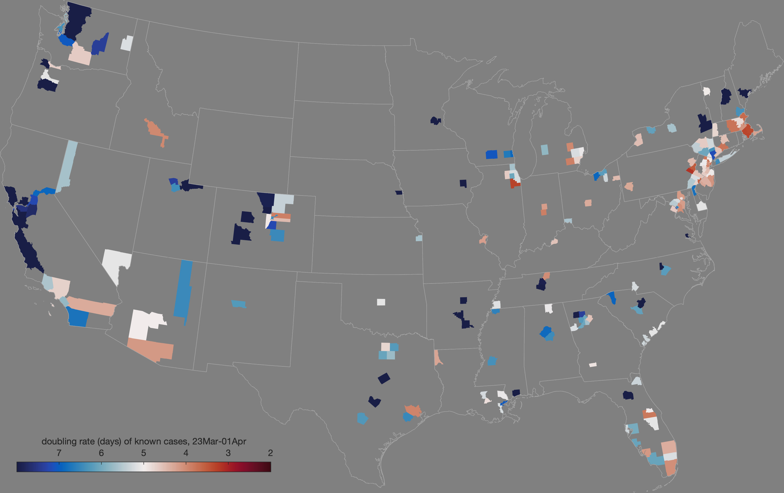

# COVID-19
## Mapping coronavirus cases in the US

This MATLAB script automatically downloads the latest daily statistics of known cases of COVID-19 and related deaths ([data from The New York Times](https://github.com/nytimes/covid-19-data)), then makes animations like this one: 

Go a little bit further and explore how the rates of doubling differ from place to place: 

 

## Requirements 
Requires the [Climate Data Toolbox for MATLAB](https://github.com/chadagreene/CDT) ([Greene et al., 2019](https://doi.org/10.1029/2019GC008392)).